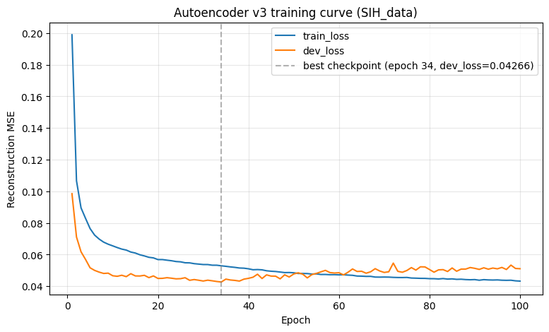
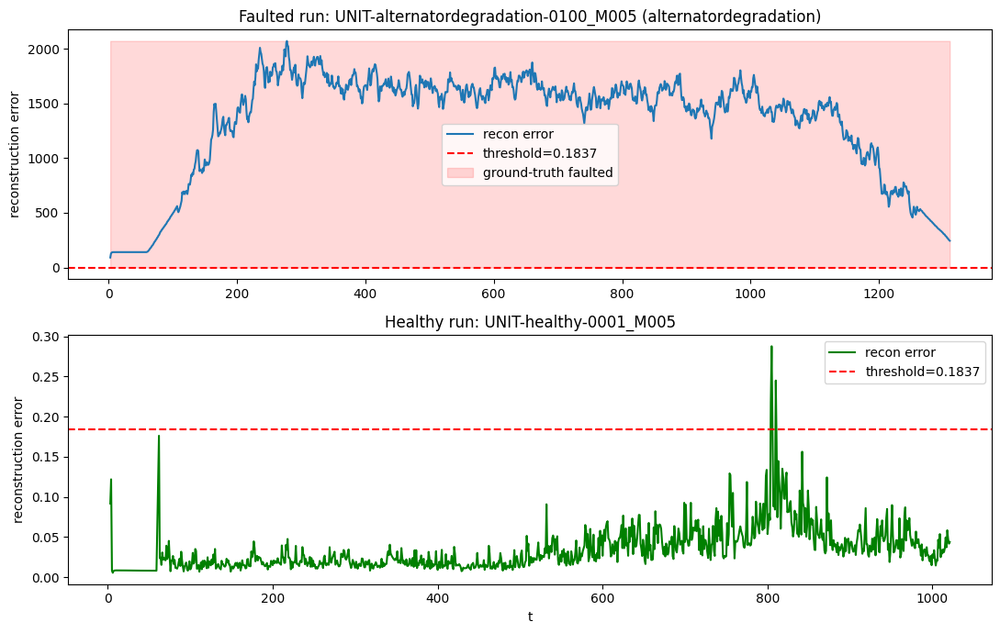

# Autoencoder — unsupervised anomaly detection

**Status: v1 and v3 both trained; v3 is wired into `backend/`.** See the
[v3](#v3-sih_data) section below for the latest version.
`autoencoder_training.ipynb` currently holds the **v3** training notebook
(run on Google Colab against `SIH_data`); it replaced the earlier v1
notebook, which produced `ml/artifacts/autoencoder/v1/` and is still
recoverable from git history if needed. `train.py`/`predict.py` below are
the real CLI entry points the notebook's `%%writefile` cells emit and then
invoke — not a stub.

`ml/artifacts/digital_twin/v3/` (27 per-channel regressors, paired with
`autoencoder/v3` per the "Digital twin" section below) now exists, so
`backend/app/core/model_loader.py`'s `load_autoencoder_bundle()` loads both
and `backend/app/modules/inference/service.py`'s
`autoencoder_anomaly_score()` scores every telemetry frame's reconstruction
error live — a third, additive anomaly signal alongside `lstm_rul`'s
`fault_type`/`health_index` and `xgboost_classifier`'s `sensor_fault_*`
fields, never merged with either. Row-level (per this README's "Row-level
(flat)" note above), so no rolling window is needed, but a frame's
`engine_state` being a gated transient (`STARTING`/`SHUTDOWN`/
`THROTTLE_TRANSIENT`) or a NaN-prone channel (e.g. vibration outside its
active states) yields `null`, same honest-gap convention as the other two
models — see `backend/CLAUDE.md`'s inference section.

Learns to reconstruct **nominal** engine behaviour. At inference, reconstruction
error becomes an anomaly score; a sustained rise flags "something is wrong"
before the supervised classifier can name the fault.

## Expected input (v1, as actually implemented)

- Source: `data/processed/<batch_name>/{train,validation}/telemetry|groundtruth/`,
  read directly by `train.py` — not a separate windowed-feature-table build step.
- Features: `ml/features/feature_engineering.py`'s `physics_residuals()` output
  (measured − digital-twin-expected, per channel; run
  `ml/features/fit_digital_twin.py` first) + operating condition (`rpm`,
  `engine_load`, `throttle`, `altitude`, `ambient_temperature`, `air_density`)
  + one-hot `engine_state`, per `docs/build_plan.md`'s Step 8 feature-vector
  design. **Row-level (flat), not windowed**, and no rolling-stat/FFT "trend
  features" — `rolling_stats()`/`extract_fft_bands()` are still unimplemented
  stubs, so a `(n_windows, window_size, n_features)` windowed encoder is a
  natural v2 once those land, not what v1 trains on.
- Standardised per feature (residuals + condition columns only; the
  engine_state one-hot is left as 0/1) using scaler statistics fitted on the
  training rows only.
- **Nominal runs only.** To avoid the digital twin's own regressors leaking
  into what should be an honest residual, training never touches rows the
  twin was fit on — it reuses `fit_digital_twin.py`'s exact healthy-run
  selection, then reproduces that script's own train/holdout run split (same
  seed, ratio recovered from `digital_twin`'s `metadata.json`) and trains only
  on the holdout half.
- Threshold selection and evaluation (ROC-AUC, false-alarm rate, detection
  rate) run on the **validation** split, using per-row ground-truth health
  columns for genuine healthy-vs-faulted labels — never on training data, per
  `ml/evaluation/README.md`.

## Output artifact

Written to `ml/artifacts/autoencoder/<version>/`:

| File | Contents |
| --- | --- |
| `model.pt` | Torch `state_dict` for the encoder/decoder |
| `scaler.json` | Per-feature mean/std used at train time |
| `threshold.json` | Anomaly threshold + the percentile rule that set it |
| `metadata.json` | Feature/residual/condition columns, hyperparameters, dataset id, metrics, run stamp |

## Metrics reported

Reconstruction MSE on held-out nominal validation rows; anomaly-detection
ROC-AUC, false-alarm rate and detection rate at the chosen threshold, all
measured against the validation split's genuinely faulted rows (used for
threshold selection and reporting only, never for weight updates).
**Detection latency** (time from `fault_onset` to sustained correct
detection) is not computed yet — a v2 addition once this is being evaluated
per fault class rather than as one pooled row-level metric.

## v3 (SIH_data)

**Dataset: `SIH_data`, not `main_batch_1000`.** 1312 train runs, 375
validation runs, 16 fault classes including healthy — this replaces
`main_batch_1000` for this version. **The two datasets are not
interchangeable**: different run counts and a different fault-class schema
(`main_batch_1000` is the 11-class set the rest of this repo's `contract/`
docs still describe; `SIH_data` uses 16). Processed output lives at
`data/processed/sih_data_v3`.

**Trained on Google Colab (T4 GPU), not local.** See
[`autoencoder_training.ipynb`](autoencoder_training.ipynb) for the full
pipeline — it writes `ml/features/fit_digital_twin.py`,
`ml/training/autoencoder/train.py` and `predict.py` via `%%writefile` cells,
then runs them against `SIH_data` inside the Colab session.

**Digital twin: fit fresh as v3, not reusing v1's twin.** The autoencoder's
physics residuals depend on the digital twin's per-channel expected-value
models, and those were re-fit on `SIH_data` from scratch —
`ml/artifacts/digital_twin/v3/`, a separate set of `.joblib` regressors from
`digital_twin/v1/`. **Pointing the v3 autoencoder at the v1 twin (or vice
versa) will silently produce garbage residuals** since the two twins were
fit on different data distributions — always pair `autoencoder/v3` with
`digital_twin/v3`.

### Metrics (from `ml/artifacts/autoencoder/v3/metadata.json` and
`ml/artifacts/digital_twin/v3/metadata.json`)

Autoencoder, `n_ae_fit_runs=96`, `n_ae_dev_runs=11` (the twin's holdout
half, per the nominal-only training rule above), `n_validation_runs=375`:

| Metric | Value |
| --- | --- |
| `validation_roc_auc` | 0.8278 |
| `validation_false_alarm_rate` | 0.0500 |
| `validation_detection_rate` | 0.6290 |
| Anomaly threshold (`threshold.json`) | 0.18367, 95th percentile of healthy validation-row reconstruction error |
| `best_dev_reconstruction_mse` | 0.04266 (epoch 34) |
| `validation_reconstruction_mse_healthy` | 0.06142 |

Hyperparameters: `epochs=100`, `batch_size=256`, `latent_dim=8`,
`learning_rate=0.001`, `dev_frac=0.1`, `seed=42`, `ae_run_pool=twin-holdout`.

Digital twin, `n_train_runs=600`, `n_eval_runs=106` (healthy runs only, per
`fit_digital_twin.py`'s selection):

| Channel | MAE | RMSE |
| --- | --- | --- |
| torque | 1.339 | 1.777 |
| power | 0.383 | 0.517 |
| cht_c1 / cht_c2 / cht_c4 | 10.632 | 14.564 |
| cht_c3 | 14.404 | 18.962 |
| egt_c1–c4 | 5.900 | 25.682 |
| oil_pressure | 0.00202 | 0.00683 |
| oil_temperature | 5.518 | 7.492 |
| fuel_flow | 0.0782 | 0.2710 |
| rail_pressure | 4.368 | 20.566 |
| injection_timing | 0.0437 | 0.2057 |
| boost_pressure | 0.00530 | 0.00726 |
| map | 0.666 | 0.906 |
| intake_temperature | 0.480 | 0.662 |
| air_mass_flow | 0.000535 | 0.000708 |
| coolant_temperature | 3.870 | 5.316 |
| vibration_rms_x | 194.815 | 281.061 |
| vibration_order_1x | 18.322 | 112.216 |
| vibration_rms_x_bearing_proxy | ~0 (3.5e-17) | ~0 (3.5e-17) |
| vibration_order_1x_bearing_proxy | 0.0 | 0.0 |
| battery_voltage | 0.119 | 0.188 |
| battery_current | 0.145 | 0.297 |
| alternator_power | 0.00201 | 0.00679 |

Full per-channel breakdown (including `n_eval` row counts) is in
`ml/artifacts/digital_twin/v3/metadata.json`.

### Training curve

Dev loss bottoms out at epoch 34 (`dev_loss≈0.043`) and rises to `~0.051` by
epoch 100 — the model overfits past epoch 34. This is expected and already
handled: training uses best-state checkpointing, so the saved `model.pt` is
the epoch-34 weights, not epoch-100's.

### Example run inspection

Reconstruction error over time for one faulted run
(`alternator_degradation`) against the healthy run's reconstruction error,
with the anomaly threshold marked on both.

### Open question — near-zero bearing-proxy twin error

`vibration_rms_x_bearing_proxy` and `vibration_order_1x_bearing_proxy` both
show near-zero MAE/RMSE when the digital twin fits them from operating
condition alone (see the table above). That means the autoencoder's
residual for these two channels is close to zero for essentially every row,
healthy or faulted, which would blunt its ability to catch bearing faults
through this signal. Worth verifying this isn't a `SIH_data` data artifact
(e.g. these columns being near-constant or a deterministic function of
`rpm`/`throttle` in this dataset) before trusting bearing-fault detection
results built on top of it — not resolved here, just flagged.
