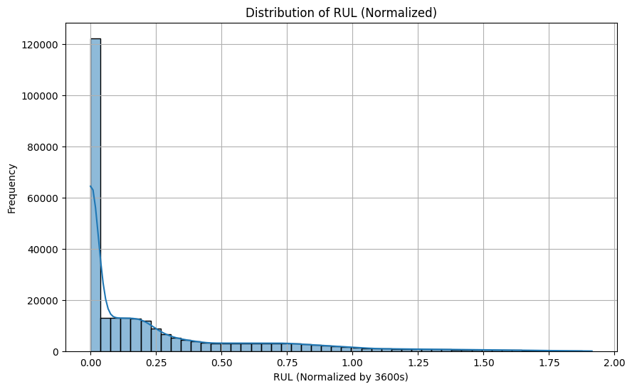
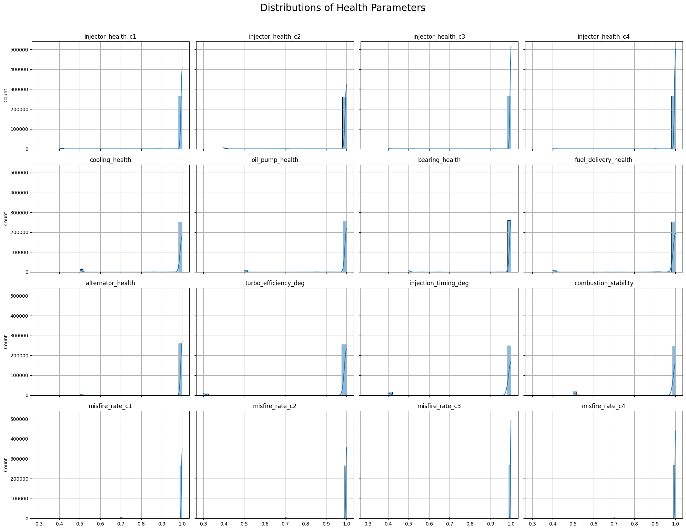
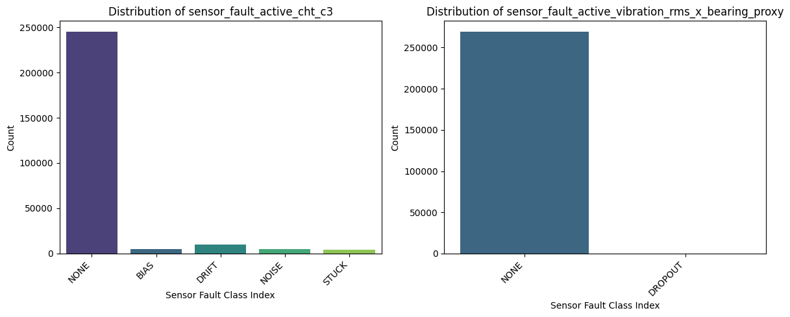
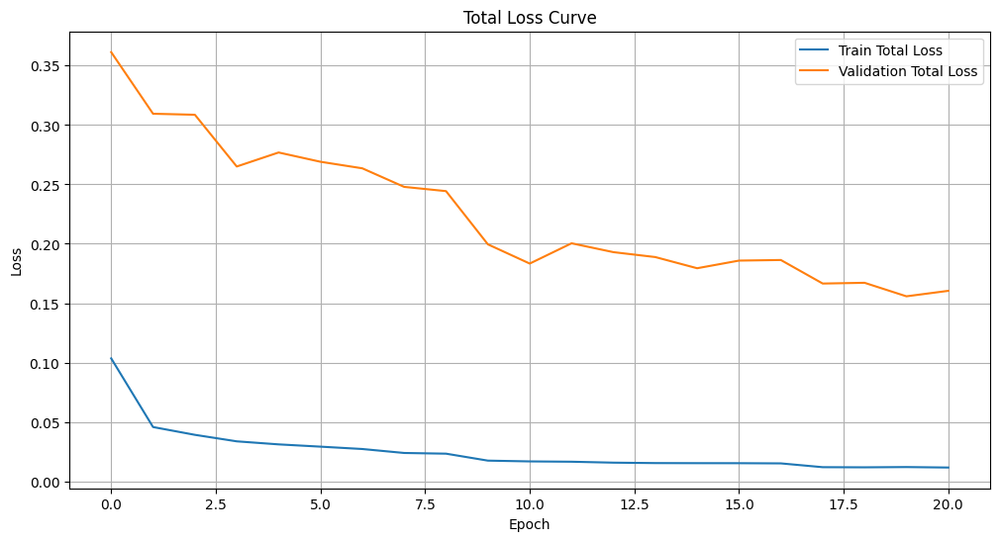
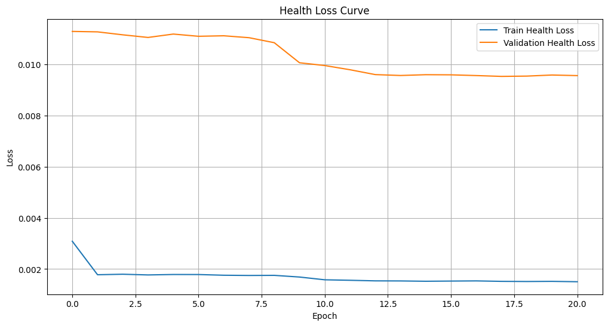
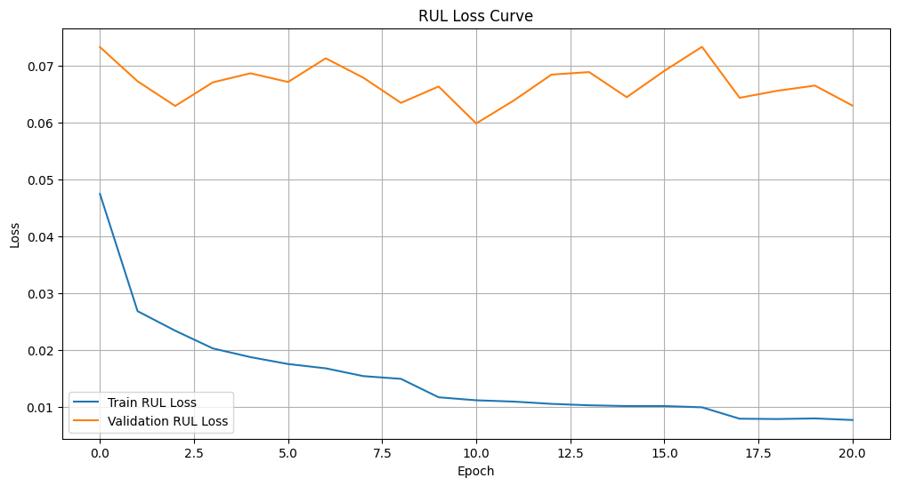
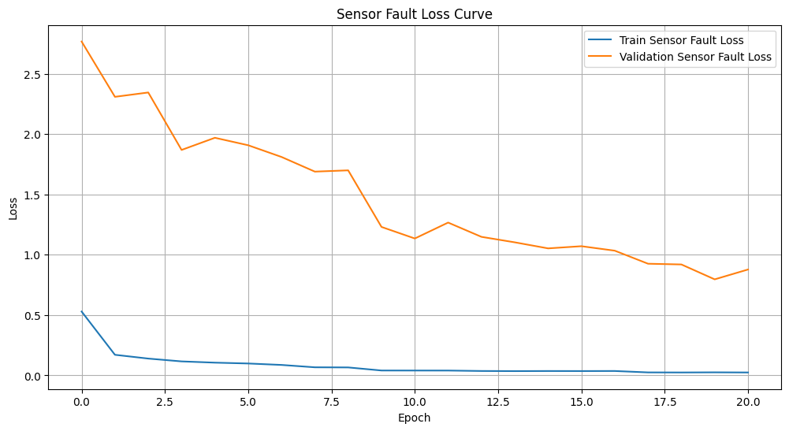

# LSTM — multi-head engine health / RUL / sensor-fault model

**Status: training in progress**, in `lstm_training.ipynb`, off
`ml/notebooks/DroneAcharaya_Preprocessing.ipynb`'s windowed output (see
`../README.md`'s "Multi-head LSTM" section — `X_train`/`X_val` plus the
three label arrays `y_health`, `y_rul`, `y_sensor_fault`). No artifact/
metrics to report yet; `train.py` below is still the CLI-stub path, not
what's actually being run right now.

Predicts how much operating time remains before the degradation crosses the
failure threshold. Sequential model because RUL depends on the *trajectory* of
degradation, not the instantaneous state.

## What it predicts, and when

One model, three heads, sharing a single LSTM encoder over a 60-timestep
(60-second, at this dataset's 1Hz export rate) input window. **Every head's
target is 60 seconds *after* the input window's last timestep** — this is a
forecasting model, not a nowcasting one. Given the last 60s of engine
behaviour, it answers "what will the engine's condition be a minute from
now," not "what is it right now." `forecast_horizon=60` in `build_windows()`
controls this; changing it changes what question the model answers.

| Head | Predicts | Loss | Output activation |
| --- | --- | --- | --- |
| A — health | 16 health-parameter scalars (`contract/health-parameter-registry.md` names), all oriented 1.0=healthy → 0.0=failed | MSE | Sigmoid (bounds to [0,1]) |
| B — RUL | Scalar remaining-useful-life, seconds, normalized by `RUL_SCALE_SECONDS=3600` during training | MSE (on normalized target) | Softplus (bounds to ≥0) |
| C — sensor fault | Per-channel fault class (`NONE`/`BIAS`/`DRIFT`/`NOISE`/`STUCK`/`DROPOUT`), one classifier per `sensor_fault_active_*` column in the data (currently 2: `cht_c3`, `vibration_rms_x_bearing_proxy`) | Cross-entropy, per channel, class-weighted by inverse train-split frequency | none (raw logits, argmax at inference) |

## Architecture

```
Input (batch, 60, 49)
  49 features = 34 scaled sensors + 3 missing-flags + 12 one-hot engine_state
        │
        ▼
  3-layer LSTM (hidden_size=256, unidirectional, dropout=0.5 between layers)
        │  (batch, 60, 256) — one hidden state per timestep
        ▼
  Attention pooling over timesteps
    attn_fc: Linear(256 → 1)
    softmax over the 60 timesteps → weights
    context = Σ (weight_t × hidden_t)         →  (batch, 256)
        │
        ▼
  shared_fc: Linear(256 → 128) → ReLU → Dropout(0.5)   →  (batch, 128)
        │
        ├──────────────┬───────────────────────┬─────────────────────────┐
        ▼              ▼                       ▼
   health_head     rul_head                sensor_fault_head
   Linear(128→64)  Linear(128→32)           Linear(128→128)
   ReLU            ReLU                     ReLU
   Linear(64→16)   Linear(32→1)             Linear(128→ channels×6)
   Sigmoid         Softplus                 reshape → (batch, channels, 6)
        │              │                       │
   16 health      1 RUL scalar          per-channel class logits
   values [0,1]   seconds/3600, ≥0      (argmax → NONE/BIAS/DRIFT/NOISE/STUCK/DROPOUT)
```

Model is **unidirectional/causal by design** — a bidirectional LSTM would let
the attention pooling see timesteps *after* the point being forecast from,
which isn't available at real inference time (there is no "future" telemetry
yet). Don't flip `bidirectional=True` without re-deriving what "future" means
for this model's actual serving context.

Attention pooling (rather than just taking the last hidden state) lets the
model weight which of the 60 input seconds matter most for a given
head/window, instead of forcing all temporal information through a single
final LSTM state.

### Multi-task loss

```python
total = alpha * health_loss + beta * rul_loss + gamma * sensor_fault_loss
# alpha=1.0, beta=1.0, gamma=0.1
```

`gamma` is deliberately lower than `alpha`/`beta`. Health and RUL are
regression losses (MSE) that behave smoothly across epochs; the sensor-fault
head's cross-entropy — even after class-weighting — is inherently noisier
epoch-to-epoch because the rare fault classes make its loss sensitive to a
handful of hard examples. A lower `gamma` keeps that noise from dominating
training and, more importantly, from dominating **checkpoint selection**
(`val_health_loss + val_rul_loss` only, not total loss).

**Optimizer / schedule**: Adam, `lr=5e-4`, `weight_decay=1e-4`, with
`ReduceLROnPlateau(mode='min', factor=0.5, patience=5)` stepped on
`checkpoint_score`, and early stopping at `patience=10` epochs of no
improvement on the same metric. `BATCH_SIZE=64`.

### New this run: `WeightedRandomSampler` — and why it backfired

This run adds a `WeightedRandomSampler` on top of the existing per-channel
class-weighted cross-entropy: for every training window, it takes the
*maximum* of that window's class weight across both sensor-fault channels,
then oversamples high-weight (rare-class) windows with replacement so each
epoch sees more of them than their natural frequency would give.

**This measurably hurt the model.** The `cht_c3` channel's NONE-class recall
collapsed from a healthy ~0.94 (previous run, loss-reweighting only) to
**0.35** — the model now predicts a fault on the majority of genuinely
healthy windows. Any-fault-detection precision on that channel fell to
**0.164** (down from 0.692), while recall rose to 0.982. In plain terms: the
sampler taught the model "when in doubt, guess a fault," which spikes
recall but makes the classifier nearly useless for an advisory system that
needs to trust a "fault detected" alert. The sensor-fault loss curve (below)
shows the mechanism directly — train loss drops to near-zero while val loss
plateaus around 0.8-1.0, a train/val gap consistent with the sampler fitting
an artificially rebalanced training distribution that no longer matches
validation's natural class frequencies.

**Do not adopt this sampler as-is.** See
[Known limitations](#known-limitations) for what to try instead.

## Training data

`data/raw/{telemetry,groundtruth}_{train,validation}.csv` — the
`main_batch_1000` MVEM export (third consolidated batch; see git history of
this file for the two prior batches' distributions), consolidated per-run
into 4 CSVs. Split is **by `run_id`**, assigned by the export itself (not a
random re-split): 1312 train runs / 375 validation runs.

Key preprocessing steps (all in `lstm_training.ipynb`, ahead of
`build_windows()`):
- Health columns sign-flipped to a single 1.0=healthy→0.0=failed convention.
- RUL computed per-run as `max(0, nearest_failure_threshold_crossing_t − t)`,
  falling back to time-to-end-of-run if no threshold is ever crossed in that
  run.
- `vibration_rms_x` / `vibration_order_1x` / `vibration_rms_x_bearing_proxy`
  are NaN during specific engine states (crank-resolved vibration sidecar
  doesn't compute a value in `IDLE`/`CRUISE`/`SHUTDOWN`/`STARTING`/
  `THROTTLE_TRANSIENT`/`LOITER`/`CLIMB`/`DESCENT`) — handled with a
  `{col}_missing` flag column plus fill-with-0 (0 = training mean, post-scaling).
- `StandardScaler` fit on training-split rows only (saved to
  `scaler.joblib`); `OneHotEncoder` for `engine_state` (12 categories) fit on
  training-split rows only.
- Windowing: `seq_len=60`, `stride=10` (not 1 — avoids a ~20GB `X_train` at
  stride 1), `forecast_horizon=60`.

### Target distributions (EDA)



RUL is heavily zero-inflated (the `max(0, ...)` clamp right-censors
everything after the first threshold crossing). Mean normalized RUL is 0.24
(std 0.35) against a max of 1.91 (~6900s) — dominated by low/zero values
with a long tail.



All 16 health parameters are similarly right-skewed — the large majority of
rows sit at 1.0 (fully healthy), with a much smaller mass spread across
lower values as degradation progresses.



Windowed training-set counts: `cht_c3` — NONE 90.97%, DRIFT 3.60%, BIAS
1.95%, NOISE 1.95%, STUCK 1.53% (244,708 / 9,695 / 5,257 / 5,238 / 4,113
windows). `vibration_rms_x_bearing_proxy` — NONE 99.92%, DROPOUT 0.08% (212
windows, up from a prior batch's 43 — see the batch-3 consolidation note in
this repo's history — but still a small absolute count for a 6-way
classifier to learn from).

## Results (this run: early-stopped at epoch 21, best checkpoint epoch 11)






Training ran for 21 of a possible 60 epochs before early stopping triggered
(`patience=10` on `health+rul` checkpoint score, best at epoch 11,
`checkpoint_score=0.0699`).

**Health head** — converges well: train loss drops to ~0.0015, val loss
tracks down to ~0.0096 with no meaningful divergence.

**RUL head** — `val_rul` sits in the `0.06-0.07` band (normalized units)
throughout, without a clear downward trend after the first few epochs —
consistent with RUL's zero-inflation dominating the aggregate metric (see
[Known limitations](#known-limitations)).

**Sensor-fault head** — full validation-set confusion matrix (not just
spot-checks):

| Channel | Accuracy | Macro F1 | Any-fault precision / recall |
| --- | --- | --- | --- |
| `sensor_fault_active_cht_c3` | 0.41 | 0.35 | 0.164 / 0.982 |
| `sensor_fault_active_vibration_rms_x_bearing_proxy` | 0.88 | 0.47 | 0.004 / 0.673 |

`cht_c3` confusion matrix shows the over-triggering directly: of 66,761
true-NONE validation windows, only 23,053 are correctly predicted NONE (35%
recall) — the remaining ~43,700 are scattered across false BIAS/DRIFT/
NOISE/STUCK predictions, with STUCK alone absorbing 22,203 of them. STUCK's
own recall is 1.00, but that's driven by the model defaulting to STUCK on
ambiguous/healthy windows, not genuine STUCK-detection skill.

`vibration_rms_x_bearing_proxy` shows the same pattern at smaller scale:
DROPOUT recall rose to 0.673 (up from 0/9 in the batch-2 run — the added
training examples plus oversampling did teach *some* signal), but precision
is 0.004 — 9,106 false-positive DROPOUT predictions against only 33 true
positives. Still not usable as a real detector.

### Single-sample checks

Illustrative only — see the aggregate confusion matrix above for the real
picture, especially given this run's precision collapse.

**Sample index 71794** (true RUL 344.0s): predicted 583.80s (+239.80s
error). Health predictions track true values closely except
`turbo_efficiency_deg` (pred 0.9931 vs true 0.5063, a sample sitting right at
that parameter's failure region). Both sensor-fault channels were
**misclassified** here (`cht_c3`: predicted STUCK, true NONE;
`vibration_rms_x_bearing_proxy`: predicted DROPOUT, true NONE) — a direct
instance of the over-triggering behavior quantified above.

**Demo cell, index 53209** (true RUL 318.0s): predicted 211.0s (-107.0s
error). `cht_c3` predicted STUCK — again consistent with the head's bias
toward over-predicting faults this run.

## Known limitations

- **The `WeightedRandomSampler` should not be used as-is.** It measurably
  regressed sensor-fault precision (see above) by training on an artificially
  rebalanced distribution that doesn't match real-world (or validation-set)
  class frequencies. Before reusing this technique: (a) validate against the
  *natural* validation distribution as done here (not a similarly-resampled
  validation set, which would hide the problem), and (b) consider a milder
  oversampling ratio (e.g. cap the max weight, or use `sqrt` of the inverse
  frequency instead of the raw ratio) rather than full inverse-frequency
  weighting combined with a hard `max()` across channels.
- **`sensor_fault_active_vibration_rms_x_bearing_proxy` (DROPOUT) is still
  data-starved.** 212 training windows out of ~269,000 (0.08%) is better than
  the previous batch's 43, but still not enough for reliable precision at any
  reasonable oversampling rate — the 9,106 false positives this run show
  that "make the model see DROPOUT more often" alone doesn't fix a
  fundamentally imbalanced problem. More real DROPOUT-class runs from
  `simulation/fault_injection/` remains the actual fix.
- **RUL accuracy on the non-zero-RUL subset is not yet aggregated as a single
  number.** The reported `val_rul` MSE is dominated by the large mass of
  windows at RUL=0; single-sample checks are illustrative, not a validated
  accuracy statistic.
- **`forecast_horizon=60` is a single fixed operating point**, not yet swept
  against alternatives on this batch.
- **Not yet ported to `ml/features/feature_engineering.py` or `train.py`.**
  Per `ml/CLAUDE.md`'s notebooks rule, this settled logic (windowing, RUL
  labeling, scaling, class weighting) should eventually move into the shared
  feature builder so `train.py` doesn't require re-running the notebook.
- **Digital-twin residuals (`ml/features/fit_digital_twin.py`'s
  `physics_residuals()`) are not fed to this model.** It trains on raw scaled
  sensor values, not operating-condition-adjusted residuals. Wiring residuals
  in as additional features is the highest-leverage remaining improvement
  identified so far, not yet attempted.

## Next step before using this checkpoint downstream

Given the precision collapse documented above, **this v1 checkpoint's
sensor-fault head should not be wired into the backend/advisory layer as-is**
— it will over-alarm on healthy engines. Health and RUL heads are unaffected
by the sampler change and remain usable. Retraining without the
`WeightedRandomSampler` (reverting to loss-only class weighting, as in the
batch-2 run) is the recommended next step before treating sensor-fault
detection as production-ready.

## Artifacts

Versioned in `ml/artifacts/lstm_rul/v1/` (gitignored; distribute out of band
per `ml/artifacts/README.md`):

| File | Contents |
| --- | --- |
| `lstm_best.pt` | Torch `state_dict`, checkpointed on best `val_health + val_rul` |
| `scaler.joblib` | Fitted `StandardScaler` for `SENSOR_COLUMNS` (train-split only) |
| `engine_state_encoder.joblib` | Fitted `OneHotEncoder` for `engine_state` (12 categories) |
| `rul_scale_seconds.json` | `{"rul_scale_seconds": 3600.0}` — required to convert the model's normalized RUL output back to seconds at inference time |
| `metadata.json` | Architecture, hyperparameters, metrics, and known issues for this version — read this before loading the checkpoint elsewhere |

All four model files are required to reproduce inference outside the
notebook — see the architecture section above for the exact
`EngineMultiHeadLSTM` constructor args (`hidden_size=256, num_layers=3,
dropout=0.5`) needed to re-instantiate the class before loading
`lstm_best.pt`'s `state_dict`.
