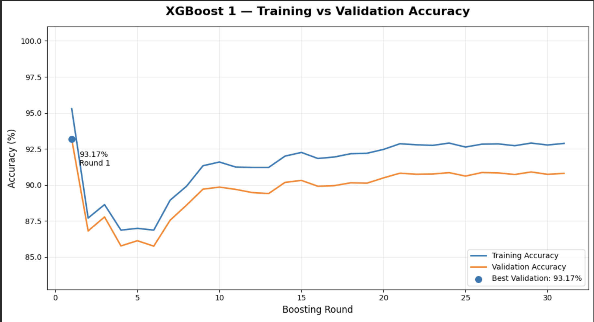
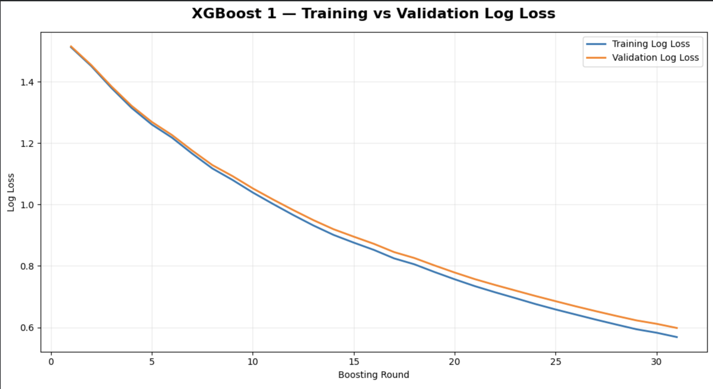
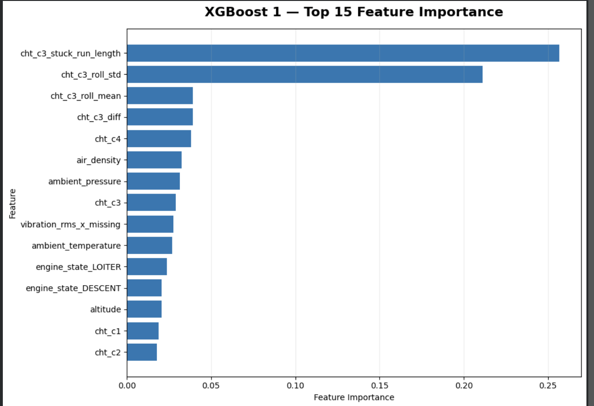
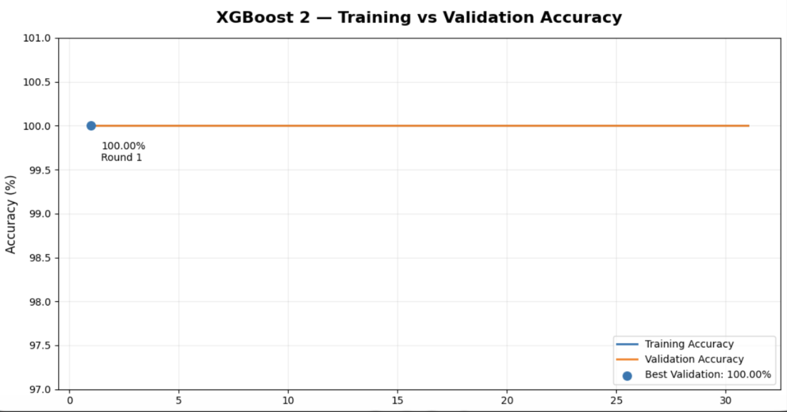
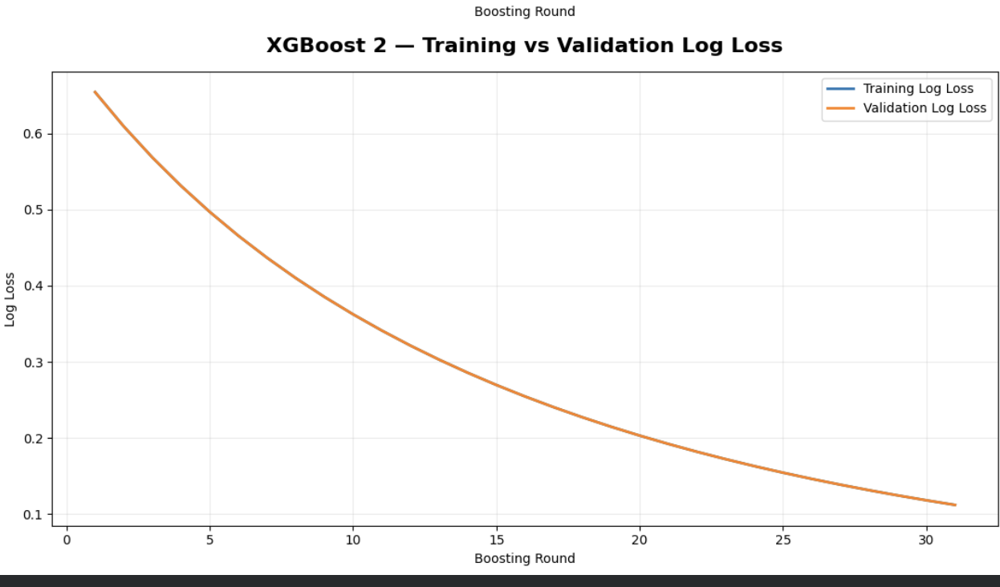
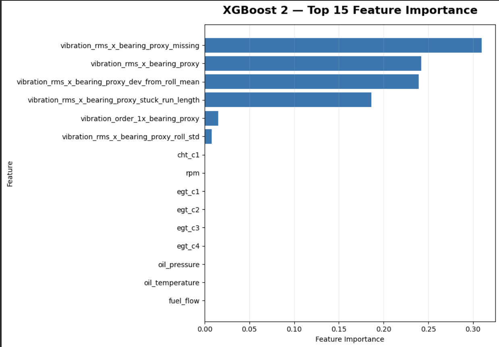

# XGBoost Sensor Fault Classification

## Overview

This module provides an independent XGBoost-based sensor fault classification pipeline using full-engine telemetry. Rather than isolating individual sensor channels, the pipeline trains two independent XGBoost classifiers that both receive the complete 56-feature engine representation. The predictions from both classifiers are then evaluated by a deterministic engine-level decision layer to determine overall engine health and identify specific active fault modes.

The system trains two independent XGBoost models:

1. **Model 1 (CHT C3)**:
   - **Target**: `sensor_fault_active_cht_c3`
   - **Classes**: `NONE`, `BIAS`, `DRIFT`, `NOISE`, `STUCK`
2. **Model 2 (Bearing Vibration)**:
   - **Target**: `sensor_fault_active_vibration_rms_x_bearing_proxy`
   - **Classes**: `NONE`, `DROPOUT`

Both models consume the identical 56 full-engine input feature matrix. The models are not restricted to their specific target sensor; each model leverages full-engine context across thermal, mechanical, fluid, electrical, and operating-state telemetry to perform fault classification. The outputs of the two classifiers are subsequently combined to evaluate overall engine health.

## Engine-Level Decision Logic

Overall engine health is evaluated by a rule-based decision layer operating directly on the inference outputs of the two trained XGBoost models:

- **If** `sensor_fault_active_cht_c3 == NONE` **AND** `sensor_fault_active_vibration_rms_x_bearing_proxy == NONE`:
  - **Result**: `ENGINE HEALTHY`
- **Otherwise**:
  - **Result**: `ENGINE FAULT`

In addition to the binary health state, the system reports the specific active fault type(s). Examples:
- `CHT C3 — DRIFT`
- `Bearing Vibration — DROPOUT`
- `CHT C3 — DRIFT + Bearing Vibration — DROPOUT`

The combined engine-health output is generated strictly by this decision layer over the two trained XGBoost models. It is not a separately trained third XGBoost classifier.

## Data

The training pipeline uses raw data from `/content/drive/MyDrive/raw`, consisting of four CSV files:
- `telemetry_train.csv`
- `telemetry_validation.csv`
- `groundtruth_train.csv`
- `groundtruth_validation.csv`

Telemetry and groundtruth files were merged using composite key `run_id + t`. The merge was validated as a strict one-to-one join, preserving the entire row count without data loss. Train and validation sets were combined for preprocessing and subsequently separated using run IDs across 1,312 training runs:

| Dataset Component | Rows | Columns |
|---|---:|---:|
| Combined Telemetry | 3,638,245 | 40 |
| Combined Groundtruth | 3,638,245 | 49 |
| Merged Dataset | 3,638,245 | 87 |
| Training Split | 2,840,460 | 56 (features) |
| Validation Split | 797,785 | 56 (features) |

## Feature Engineering

The final XGBoost feature matrix contains 56 input features. Both models receive this full 56-feature engine representation:

### 1. Base Full-Engine Telemetry Features (34 features)
- **Engine Performance & Dynamics**: `rpm`, `torque`, `power`, `engine_load`, `throttle`
- **Cylinder Head Temperatures**: `cht_c1`, `cht_c2`, `cht_c3`, `cht_c4`
- **Exhaust Gas Temperatures**: `egt_c1`, `egt_c2`, `egt_c3`, `egt_c4`
- **Fluids & Pressures**: `oil_pressure`, `oil_temperature`, `fuel_flow`, `rail_pressure`, `injection_timing`, `boost_pressure`, `map`, `intake_temperature`, `air_mass_flow`, `coolant_temperature`
- **Vibration Signals**: `vibration_rms_x`, `vibration_order_1x`, `vibration_rms_x_bearing_proxy`, `vibration_order_1x_bearing_proxy`
- **Electrical & Ambient**: `battery_voltage`, `battery_current`, `alternator_power`, `altitude`, `ambient_pressure`, `ambient_temperature`, `air_density`

### 2. Missing-Value Indicators (3 features)
Binary indicators tracking NaN-prone vibration signals during inactive sidecar states:
- `vibration_rms_x_missing`
- `vibration_order_1x_missing`
- `vibration_rms_x_bearing_proxy_missing`

### 3. Rolling & Time-Series Features (10 features)
Computed over a 10-second rolling window at the dataset's native 1 Hz sampling frequency for the two fault-prone sensor channels (`cht_c3` and `vibration_rms_x_bearing_proxy`):
- Rolling Mean (`roll_mean`)
- Rolling Standard Deviation (`roll_std`)
- Deviation from Rolling Mean (`dev_from_roll_mean`)
- Difference from Previous Timestep (`diff`)
- Stuck Run Length (`stuck_run_length`)

### 4. Engine-State One-Hot Encoding (9 features)
One-hot categorical indicators for observed operational regimes:
- `CLIMB`
- `CRUISE`
- `DESCENT`
- `HIGH_ALTITUDE_CRUISE`
- `IDLE`
- `LOITER`
- `SHUTDOWN`
- `STARTING`
- `THROTTLE_TRANSIENT`

**Final Matrix Dimensions**:
- **Training Set**: `(2,840,460, 56)`
- **Validation Set**: `(797,785, 56)`

Both models receive all 56 features.

## Target Distribution

### CHT C3 (`sensor_fault_active_cht_c3`)

| Class | Training Split Count | Validation Split Count |
|---|---:|---:|
| `NONE` | 2,583,848 | 705,144 |
| `BIAS` | 55,655 | 15,155 |
| `DRIFT` | 102,217 | 33,953 |
| `NOISE` | 55,348 | 21,975 |
| `STUCK` | 43,392 | 21,558 |
| **Total** | **2,840,460** | **797,785** |

### Bearing Vibration (`sensor_fault_active_vibration_rms_x_bearing_proxy`)

| Class | Training Split Count | Validation Split Count |
|---|---:|---:|
| `NONE` | 2,838,301 | 797,299 |
| `DROPOUT` | 2,159 | 486 |
| **Total** | **2,840,460** | **797,785** |

The bearing-vibration validation split is extremely imbalanced (797,299 `NONE` vs. 486 `DROPOUT`). Therefore, the 100% validation accuracy must be interpreted in conjunction with class-level support and class distribution rather than as evidence that the model is universally perfect.

## Class Weighting

Class-weighted sample weights were applied during training to address severe class imbalance, assigning larger penalty weights to minority fault classes:

### CHT C3 Class Weights
- `NONE`: 0.1832189819
- `BIAS`: 8.5061539844
- `DRIFT`: 4.6314213878
- `NOISE`: 8.5533352605
- `STUCK`: 10.9100755900

### Bearing Vibration Class Weights
- `NONE`: 0.1667934444
- `DROPOUT`: 219.2728114868

Minority classes receive substantially larger weights during training to ensure high recall on rare fault events.

## Preprocessing

The preprocessing pipeline includes:
- `StandardScaler` fitted on the training split continuous features.
- `OneHotEncoder` fitted on the training split for `engine_state`.
- Missing-value indicators created for relevant vibration features.
- NaN-prone vibration values handled during preprocessing.
- Preprocessing artifacts (scaler and encoder) saved separately.

## Model Configuration

Two independent XGBoost classifiers were trained with the following configuration:

```python
n_estimators = 500          # Maximum boosting rounds
max_depth = 8
learning_rate = 0.05
subsample = 0.8
colsample_bytree = 0.8
objective = "multi:softprob"
tree_method = "hist"
random_state = 42
n_jobs = -1
early_stopping_rounds = 30
eval_metric = ["mlogloss", "merror"]
```

Both training and validation sets were supplied during model training so that training-versus-validation metrics could be recorded across iterations. A maximum of 500 boosting rounds was configured, with early stopping stopping training earlier when validation loss ceased to improve for 30 consecutive rounds.

## XGBoost 1 — CHT C3 Fault Classification

### Results

Validation classification report across 797,785 validation samples:

| Class | Precision | Recall | F1-Score | Support |
|---|---:|---:|---:|---:|
| `NONE` | 0.97 | 0.96 | 0.97 | 705,144 |
| `BIAS` | 0.43 | 0.44 | 0.43 | 15,155 |
| `DRIFT` | 0.36 | 0.42 | 0.39 | 33,953 |
| `NOISE` | 1.00 | 1.00 | 1.00 | 21,975 |
| `STUCK` | 1.00 | 1.00 | 1.00 | 21,558 |
| **Macro Average** | **0.75** | **0.76** | **0.76** | **797,785** |
| **Weighted Average** | **0.94** | **0.93** | **0.93** | **797,785** |
| **Overall Accuracy** | | | **93%** | **797,785** |



*XGBoost 1 training and validation accuracy across boosting rounds. The displayed best validation accuracy is 93.17% at Round 1.*

The screenshot shows the best validation accuracy as 93.17% at Round 1. Round 1 is not claimed as the final selected model unless supported by the actual saved model's best iteration.



*XGBoost 1 training and validation log loss across boosting rounds.*

### Feature Importance

Top 15 features ranked by XGBoost feature importance for CHT C3 fault classification:

| Rank | Feature | Importance |
|---:|---|---:|
| 1 | `cht_c3_stuck_run_length` | 0.256877 |
| 2 | `cht_c3_roll_std` | 0.211221 |
| 3 | `cht_c3_roll_mean` | 0.039356 |
| 4 | `cht_c3_diff` | 0.039230 |
| 5 | `cht_c4` | 0.038113 |
| 6 | `air_density` | 0.032690 |
| 7 | `ambient_pressure` | 0.031589 |
| 8 | `cht_c3` | 0.028873 |
| 9 | `vibration_rms_x_missing` | 0.027794 |
| 10 | `ambient_temperature` | 0.026946 |
| 11 | `engine_state_LOITER` | 0.023632 |
| 12 | `engine_state_DESCENT` | 0.020504 |
| 13 | `altitude` | 0.020488 |
| 14 | `cht_c1` | 0.018987 |
| 15 | `cht_c2` | 0.017988 |



*Top 15 features ranked by XGBoost feature importance for CHT C3 fault classification.*

**Interpretation**:
XGBoost 1 primarily relies on temporal and statistical behavior of CHT C3, particularly stuck-run length (`cht_c3_stuck_run_length`: 0.256877) and rolling variability (`cht_c3_roll_std`: 0.211221). Neighboring cylinder head temperatures (`cht_c4`, `cht_c1`, `cht_c2`) and atmospheric context (`air_density`, `ambient_pressure`, `ambient_temperature`, `altitude`) provide operational baselines. Despite these dominant features, the model receives all 56 full-engine features.

## XGBoost 2 — Bearing Vibration Fault Classification

### Results

Validation classification report across 797,785 validation samples:

| Class | Precision | Recall | F1-Score | Support |
|---|---:|---:|---:|---:|
| `NONE` | 1.00 | 1.00 | 1.00 | 797,299 |
| `DROPOUT` | 1.00 | 1.00 | 1.00 | 486 |
| **Macro Average** | **1.00** | **1.00** | **1.00** | **797,785** |
| **Weighted Average** | **1.00** | **1.00** | **1.00** | **797,785** |
| **Overall Accuracy** | | | **100%** | **797,785** |



*XGBoost 2 training and validation accuracy across boosting rounds. Validation accuracy remains at 100%.*



*XGBoost 2 training and validation log loss across boosting rounds.*

Because the validation set contains 797,299 `NONE` samples and 486 `DROPOUT` samples, accuracy alone is not sufficient to characterize performance on this highly imbalanced target.

### Feature Importance

Top 15 features ranked by XGBoost feature importance for bearing-vibration dropout classification:

| Rank | Feature | Importance |
|---:|---|---:|
| 1 | `vibration_rms_x_bearing_proxy_missing` | 0.309459 |
| 2 | `vibration_rms_x_bearing_proxy` | 0.242026 |
| 3 | `vibration_rms_x_bearing_proxy_dev_from_roll_mean` | 0.239268 |
| 4 | `vibration_rms_x_bearing_proxy_stuck_run_length` | 0.186169 |
| 5 | `vibration_order_1x_bearing_proxy` | 0.015061 |
| 6 | `vibration_rms_x_bearing_proxy_roll_std` | 0.007839 |
| 7 | `cht_c1` | 0.000178 |
| 8 | `rpm` | 0.000000 |
| 9 | `egt_c1` | 0.000000 |
| 10 | `egt_c2` | 0.000000 |
| 11 | `egt_c3` | 0.000000 |
| 12 | `egt_c4` | 0.000000 |
| 13 | `oil_pressure` | 0.000000 |
| 14 | `oil_temperature` | 0.000000 |
| 15 | `fuel_flow` | 0.000000 |



*Top 15 features ranked by XGBoost feature importance for bearing-vibration dropout classification.*

**Interpretation**:
XGBoost 2 is primarily driven by the bearing vibration proxy's missingness (`vibration_rms_x_bearing_proxy_missing`: 0.309459), raw value (`vibration_rms_x_bearing_proxy`: 0.242026), deviation from rolling mean (`vibration_rms_x_bearing_proxy_dev_from_roll_mean`: 0.239268), and stuck-run behavior (`vibration_rms_x_bearing_proxy_stuck_run_length`: 0.186169). The model still receives all 56 full-engine features.

## Combined Engine Health Detection

The inference outputs of the two independent classifiers are combined after inference using deterministic decision logic:

- `sensor_fault_active_cht_c3 == NONE` **AND** `sensor_fault_active_vibration_rms_x_bearing_proxy == NONE` $\rightarrow$ `ENGINE HEALTHY`
- **Otherwise** $\rightarrow$ `ENGINE FAULT`

### Combined Validation Metrics

- **Engine Validation Accuracy**: `94.09%` (0.94)
- **Fault Precision**: `73%` (0.73)
- **Fault Recall**: `77%` (0.77)
- **Fault F1-Score**: `75%` (0.75)
- **Macro F1-Score**: `86%` (0.86)

| Condition | Precision | Recall | F1-Score | Support |
|---|---:|---:|---:|---:|
| `ENGINE HEALTHY` | 0.97 | 0.96 | 0.97 | 704,658 |
| `ENGINE FAULT` | 0.73 | 0.77 | 0.75 | 93,127 |
| **Accuracy** | | | **0.94** | **797,785** |
| **Macro Average** | **0.85** | **0.87** | **0.86** | **797,785** |
| **Weighted Average** | **0.94** | **0.94** | **0.94** | **797,785** |

### Combined Confusion Matrix

| Actual Condition | Predicted Healthy | Predicted Fault | Total Actual |
|---|---:|---:|---:|
| **Actual Healthy** | 678,521 | 26,137 | 704,658 |
| **Actual Fault** | 20,996 | 72,131 | 93,127 |
| **Total Predicted** | 699,517 | 98,268 | 797,785 |

**Confusion Matrix Interpretation**:
- **True Healthy**: 678,521 samples correctly identified as healthy.
- **Healthy Incorrectly Predicted as Fault (False Positives)**: 26,137 samples.
- **Fault Incorrectly Predicted as Healthy (False Negatives)**: 20,996 samples.
- **True Fault**: 72,131 samples correctly identified as faulted.

The combined engine health result is a decision layer over the two trained XGBoost models and is not a separately trained third XGBoost model.

## Results Summary

| Model | Target | Classes | Validation Accuracy | Macro F1 |
|---|---|---|---:|---:|
| XGBoost 1 | CHT C3 | 5 (`NONE`, `BIAS`, `DRIFT`, `NOISE`, `STUCK`) | 93% | 0.76 |
| XGBoost 2 | Bearing Vibration | 2 (`NONE`, `DROPOUT`) | 100% | 1.00 |
| Combined | Engine Health | Healthy / Fault | 94.09% | 0.86 |

The bearing-vibration classifier achieves 100% validation accuracy on the evaluated validation set, but that set contains 797,299 NONE samples and only 486 DROPOUT samples. Therefore, the result should be interpreted together with class-level metrics and class distribution rather than accuracy alone.

## Known DRIFT Run Sanity Check

A known continuous sensor drift run was evaluated separately as an isolated sanity check:

- **Run ID**: `UNIT-sensorfaultdemodrift-0009_M002`
- **Number of Rows**: 1,486
- **Actual Label**: `DRIFT` for all 1,486 rows
- **Predictions**:
  - `NONE`: 1
  - `DRIFT`: 1,485
- **Identification Rate**: $1,485 / 1,486 \approx 99.93\%$

This single-run check confirms that 99.93% of timesteps were correctly identified as DRIFT on this specific known run. This is a targeted sanity check and is not the overall validation accuracy. The overall CHT C3 validation accuracy is 93%.

## Saved Artifacts

Model files and configurations are stored under `ml_artifacts/xgboost_classifier/models/`:

| File | Type | Description |
|---|---|---|
| `xgboost_cht_c3.json` | Trained Model | Native XGBoost model dump for CHT C3 fault classification |
| `xgboost_bearing_vibration.json` | Trained Model | Native XGBoost model dump for bearing vibration dropout classification |
| `xgboost_combined_engine.json` | Decision Config | Combined engine decision configuration and logic over the two trained models |

The first two files represent actual trained XGBoost models. The third represents the combined engine decision configuration and logic over the two trained models, not a separately trained classifier. Preprocessing artifacts such as the scaler (`StandardScaler`) and encoder (`OneHotEncoder`) are saved separately.

## Training Notebook

The complete XGBoost training and evaluation pipeline is contained in:

- [xgboost_training.ipynb](xgboost_training.ipynb)

